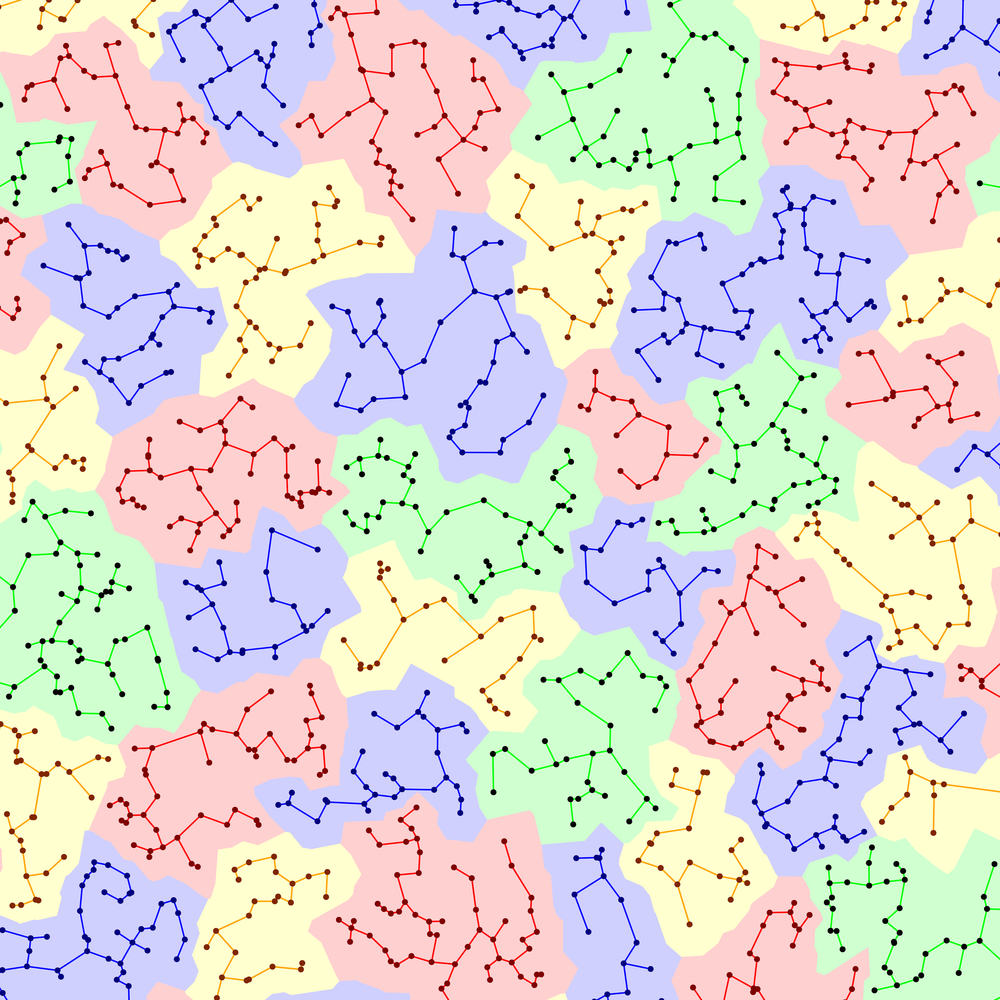

cath-cluster
============

[**Downloads**](https://github.com/UCLOrengoGroup/cath-tools/releases/latest)

A simple way to complete-linkage cluster arbitrary data.

 
*__Above__: A complete-linkage clustering of randomly generated points based on the distances between them*

Features
--------

 * Fast
 * Simple

Usage
-----

The current full `--help` usage information is:

~~~~~no-highlight
Usage: cath-cluster --link_dirn <dirn> [options] <input_file>

Cluster items based on the links between them.

When <input_file> is -, the links are read from standard input.

The clustering is complete-linkage.

Miscellaneous:
  -h [ --help ]                 Output help message
  -v [ --version ]              Output version information

Input:
  --link_dirn <dirn>            Interpret each link value as <dirn>, one of:
                                   DISTANCE - A higher value means the corresponding two entries are more distant
                                   STRENGTH - A higher value means the corresponding tow entries are more connected
  --column_idx <colnum> (=3)    Parse the link values (distances/strengths) from column number <colnum>
                                Must be ≥ 3 because columns 1 and 2 must contain the IDs
  --names-infile <file>         [RECOMMENDED] Read names and sorting scores from file <file> (or '-' for stdin)

Clustering:
  --levels <levels>             Cluster at levels <levels>, which is ordered values separated by commas (eg 35,60,95,100)

Output:
  --clusters-to-file <file>     Write the clustering to file <file> (or '-' for stdout)
  --merges-to-file <file>       Write the ordered list of merges to file <file> (or '-' for stdout)
  --clust-spans-to-file <file>  Write links that form spanning trees for each cluster to file <file> (or '-' for stdout)
  --reps-to-file <file>         Write the list of representatives to file <file> (or '-' for stdout)

Links input format: `id1 id2 other columns afterwards`
...where --column_idx can be used to specify the column that contains the values

Names input format: `id score`
...where score is used to sort such that lower-scored entries appear earlier

Please tell us your cath-tools bugs/suggestions : https://github.com/UCLOrengoGroup/cath-tools/issues/new
~~~~~

Feedback
--------

Please tell us about your cath-tools bugs/suggestions [here](https://github.com/UCLOrengoGroup/cath-tools/issues/new).
