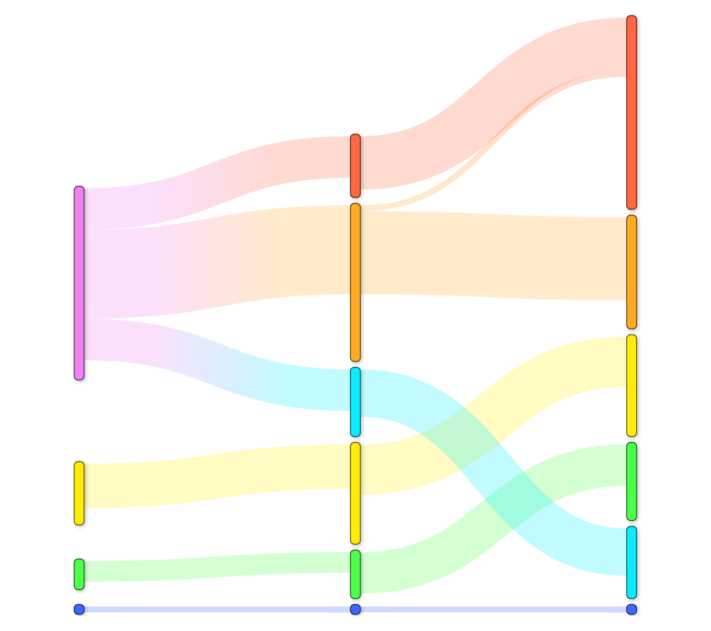

cath-map-clusters
=================

[**Downloads**](https://github.com/UCLOrengoGroup/cath-tools/releases/latest)

A simple way to map between different partitions (clusterings, sub-groupings) of a group of entities. Accounts for equivalences between domains specified on slightly differing regions of a parent sequence. Renumbers any clusters with no equivalents.

 
*__Above__: An illustration of cath-map-clusters' task of mapping between different sets of clusters*

Features
--------

 * Fast
 * Simple

Usage
-----

The current full `--help` usage information is:

~~~~~no-highlight
Usage: cath-map-clusters [options] <input_file>

Map names from previous clusters to new clusters based on (the overlaps between)
their members (which may be specified as regions within a parent sequence).
Renumber any clusters with no equivalents.

When <input_file> is -, the input is read from standard input.

Miscellaneous:
  -h [ --help ]                         Output help message
  -v [ --version ]                      Output version information

Input:
  --map-from-clustmemb-file <file>      Map numbers from previous clusters specified in <file> to their equivalents in the working clusters where possible
                                        (of, if unspecified, renumber all working clusters from 1 upwards)
                                        Cluster names in this file must be positive integers
  --read-batches-from-input             Read batches of work from the input file with lines of format: `batch_id working_clust_memb_file prev_clust_memb_file` where:
                                         * batch_id             is a unique label for the batch (with no whitespace)
                                         * prev_clust_memb_file is optional

Mapping:
  --min_equiv_dom_ol <percent> (=60)    Define domain equivalence as: sharing more than <percent>% of residues (over the longest domain)
                                        (where <percent> must be ≥ 50)
  --min_equiv_clust_ol <percent> (=60)  Define cluster equivalence as: more than <percent>% of the map-from cluster's members having equivalents in the working cluster
                                        (where <percent> must be ≥ 50)

Output:
  --append-batch-id <id>                Append batch ID <id> as an extra column in the results output (equivalent to the first column in a --multi-batch-file input file)
  --output-to-file <file>               Write output to file <file> (or, if unspecified, to stdout)
  --summarise-to-file <file>            Print a summary of the renumbering to file <file>

The cluster membership file should contain lines like:

cluster_name domain_id

...where domain_id is a sequence/protein name, which may optionally be suffixed with notation like  '/100-199,350-399' to indicate the domain's segments. The suffixes should be present for all of the domain IDs or for none of them. Domains should be unique and non-overlapping.

Please tell us your cath-tools bugs/suggestions : https://github.com/UCLOrengoGroup/cath-tools/issues/new
~~~~~

## Sorting criteria for new, unmapped clusters

 * Descending on sum over domains of `sqrt(total_dom_length)` (ie clusters with more/longer sequences come earlier, with more emphasis on having more sequences)
 * Descending on number of sequences (ie clusters with more sequences come first)
 * Ascending on average mid-point index (ie clusters with domains earlier in their sequences come first)
 * Ascending on first domain ID

If neither of a pair of clusters is preferred by one criterion, the comparison drops down to the next.

Feedback
--------

Please tell us about your cath-tools bugs/suggestions [here](https://github.com/UCLOrengoGroup/cath-tools/issues/new).
