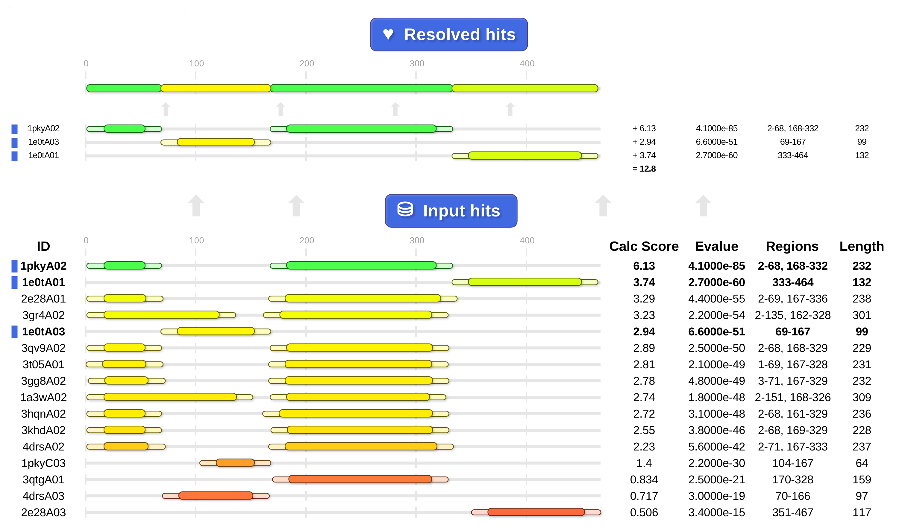

cath-resolve-hits
=================

A fast, effective way to collapse a list of domain matches to your query sequence(s) down to the best, non-overlapping subset (ie domain architecture).

 
*__Above__: cath-resolve-hits chooses the hits at the top from the list of possible hits at the bottom*

Features
--------

**Fast**

 * Can process around 1-2 million input hits per second

**Powerful**

 * Finds the optimal result that maximises the sum of hits' scores
 * Enables visualisation of results via graphical HTML
 * Supports tolerance for overlaps between hits; auto-resolves any that occur

**Simple**

 * Uses a simple default input file format
 * Also accepts HMMER domtblout files and hmmsearch output files
 * Accepts input that hasn't been pre-sorted or even pre-grouped (but can exploit that where specified)

**Configurable**

 * Allows users to determine their own scoring system to be maximised
 * Offers many easy-to-use options to configure the default behaviour

<!--
TODOCUMENT:
 * open scoring scheme
-->

Getting started
---------------

At present, `cath-resolve-hits` only requires one argument: a file which, by default, contains lines like:

~~~~~no-highlight
qyikaz 1mkfA01/12-210-i5_1,2.9e-20 2983.29780221221 3-103
qyikaz 1mkfA01/12-210-i5_2,4.9e-19 3510.41568607646 101-224
qyikaz 1mkfA01/12-210-i5_3,7e-25 3552.10980383852 825-928
qyikaz 1mkfA01/12-210-i5_4,3.5e-15 2470.04912752062 953-1053
~~~~~

Where the fields are space-separated and are:

 1. **query_protein_id** : An identifier for the query protein sequence
 1. **match_id**         : An identifier for the match
 1. **score**            : A (strictly positive) score indicating how good it would be to have that hit in the final result
 1. **starts_stops**     : The starts/stops on the query sequence, given in the format: 37-124,239-331

The output is the non-overlapping subset that maximises the sum of the hits' scores.

The input file can contain data for multiple different query protein sequences and they needn't be grouped into consecutive lines (though if they are, specify the `--input-hits-are-grouped` option).

Usage
-----

The current full `--help` usage information is:

~~~~~no-highlight
Usage: cath-resolve-hits [options] <input_file>

Collapse a list of domain matches to your query sequence(s) down to the
non-overlapping subset (ie domain architecture) that maximises the sum of the
hits' scores.

When <input_file> is -, the input is read from standard input.

The input data may contain unsorted hits for different query protein sequences.

However, if your input data is already grouped by query protein sequence, then
specify the --input-hits-are-grouped flag for faster runs that use less memory.

Miscellaneous:
  -h [ --help ]                                  Output help message
  -v [ --version ]                               Output version information

Input:
  --input-format <format> (=raw_with_scores)     Parse the input data from <format>, one of available formats:
                                                    hmmer_domtmblout - HMMER domtblout format (must assume all hits are continuous)
                                                    hmmsearch_out    - HMMer hmmsearch output format (can be used to deduce discontinuous hits)
                                                    raw_with_scores  - "raw" format with scores
                                                    raw_with_evalues - "raw" format with evalues
  --min-gap-length <length> (=30)                When parsing starts/stops from alignment data, ignore gaps of less than <length> residues
  --input-hits-are-grouped                       Rely on the input hits being grouped by query protein
                                                 (so the run is faster and uses less memory)

Segment overlap/removal:
  --overlap-trim-spec <trim> (=50/30)            Allow different hits' segments to overlap a bit by trimming all segments using spec <trim>
                                                 of the form n/m (n is a segment length; m is the *total* length to be trimmed off both ends)
                                                 For longer segments, total trim stays at m; for shorter, it decreases linearly (to 0 for length 1).
                                                 To choose: set m to the biggest total trim you'd want for a really long segment;
                                                            then, set n to length of the shortest segment you'd want to have that total trim
  --min-seg-length <length> (=7)                 Ignore all segments that are fewer than <length> residues long

Hit preference:
  --long-domains-preference <val> (=0)           Prefer longer hits to degree <val>
                                                 (<val> may be negative to prefer shorter; 0 leaves scores unaffected)
  --high-scores-preference <val> (=0)            Prefer higher scores to degree <val>
                                                 (<val> may be negative to reduce preference for higher scores; 0 leaves scores unaffected)
  --apply-cath-rules                             Apply rules specific to CATH-Gene3D during the parsing and processing

Hit filtering:
  --worst-permissible-evalue <evalue> (=0.001)   Ignore any hits with an evalue worse than <evalue>
  --worst-permissible-bitscore <bitscore> (=10)  Ignore any hits with a bitscore worse than <bitscore>
  --worst-permissible-score <score>              Ignore any hits with a score worse than <score>
  --filter-query-id <id>                         Ignore all input data except that for query protein(s) <id>
                                                 (may be specified multiple times for multiple query proteins)

Output:
  --output-file <file>                           Write output to file <file> (or, if unspecified, to stdout)
  --output-trimmed-hits                          When writing out the final hits, output the hits' starts/stop as they are *after trimming*
  --html-output                                  Output the results as HTML

Detailed help:
  --cath-rules-help                              Show help on the rules activated by the --apply-cath-rules option
  --raw-format-help                              Show help about the raw input formats (raw_with_scores and raw_with_evalues)

Please tell us your cath-tools bugs/suggestions : https://github.com/UCLOrengoGroup/cath-tools/issues/new
~~~~~

Output format
-------------

The standard output is one line per selected hit. Each line contains the following space-separated fields: `query_protein_id`, `match_id`, `score`, `starts_stops` `resolved_starts_stops` (where `resolved_starts_stops` is like `starts_stops` but may include adjustments made to resolve overlaps between hits.)

Alternatively, the `--html-output` triggers HTML output.

Warning
-------

For now, don't set `--high-scores-preference` too high (say, above 3.5) because otherwise the range of scores will exceed what can be reliably handled by a 32-bit floating point number. 

<!-- Example: 3uunB00_round_3 drops out of 98300abb63cbbe1df0ce443557c9e767's results at --high-scores-preference around 4.9971849915 because it's crh-score (2.91038000874e-11 from bitscore 12.1) is small enough to not have any effect when added to a float representation of the best hit's score (5.40697294016e-4 from bitscore 233.9) ) -->

How Fast?
---------

To give a very rough idea: on an SSD-enable laptop, we've seen `cath-resolve-hits` process some large data files at around 1-2 million hits per second. That test setup was probably a bit unrealistic so your mileage may vary significantly. For reference: the GCC build appeared to run quite a bit faster than the Clang build.

CATH Rules invoked by option `--apply-cath-rules`
-------------------------------------------------

The `--apply-cath-rules` option applies the following CATH-Gene3D specific rules when parsing from `hmmer_domtmblout` or `hmmsearch_out` format files.

### Discontinuous domains

If hit's match ID is like `dc_72a964d791dea7a3dd35a8bbf49385b8` (matches `/^dc_\w{32}$/`), then:

 * use the `ali_from`/`ali_to` fields rather than `env_from`/`env_to` to determine the final start/stop and
 * ignore gaps when parsing an alignment from a hmmsearch_outfile (ie keep the hit as one continuous segment).

### Bitscore reductions

If the conditional-evalue is &le; 0.001 but the independent-value is > 0.001, then quarter the bitscore when parsing the hit.

Otherwise, if the hit's match ID is like `1pbyB00_round_3` (matches `/_round_\d+$/` but not `/_round_1$/`), then halve the bitscore when parsing the hit.

Feedback
--------

Please tell us about your cath-tools bugs/suggestions [here](https://github.com/UCLOrengoGroup/cath-tools/issues/new).
