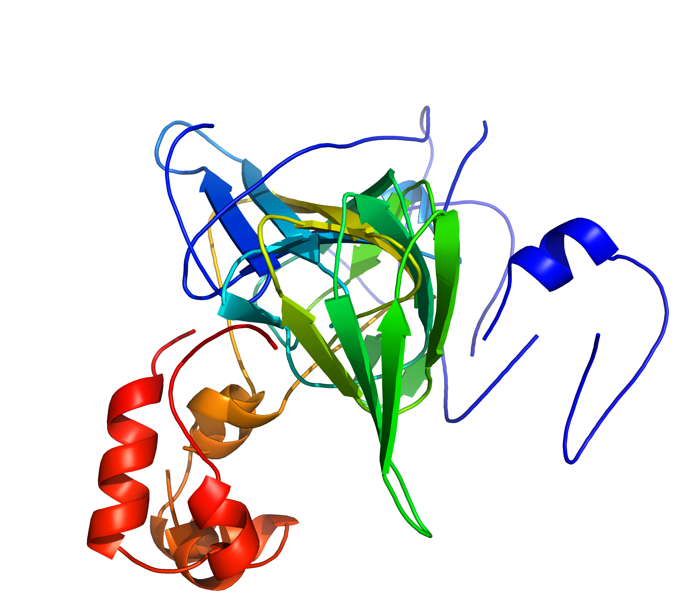
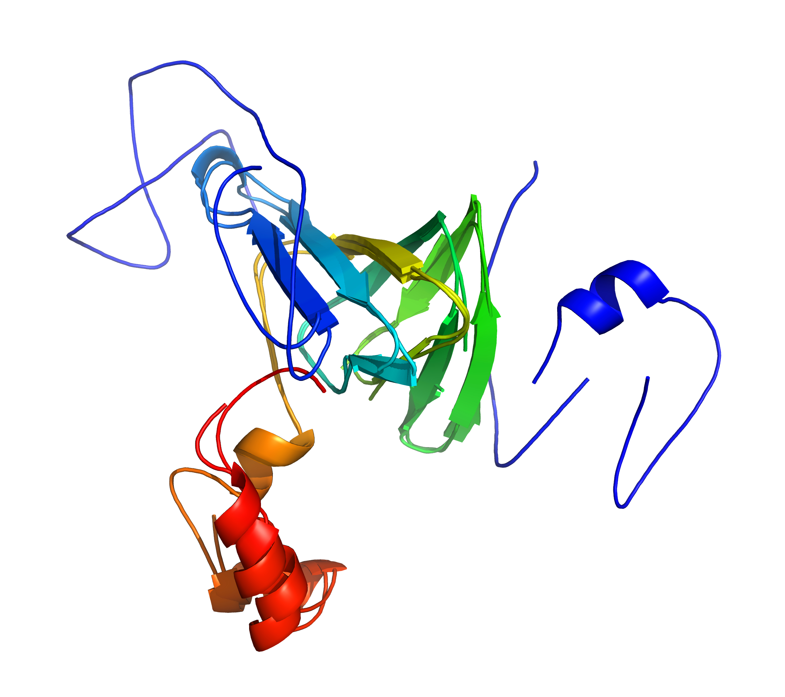
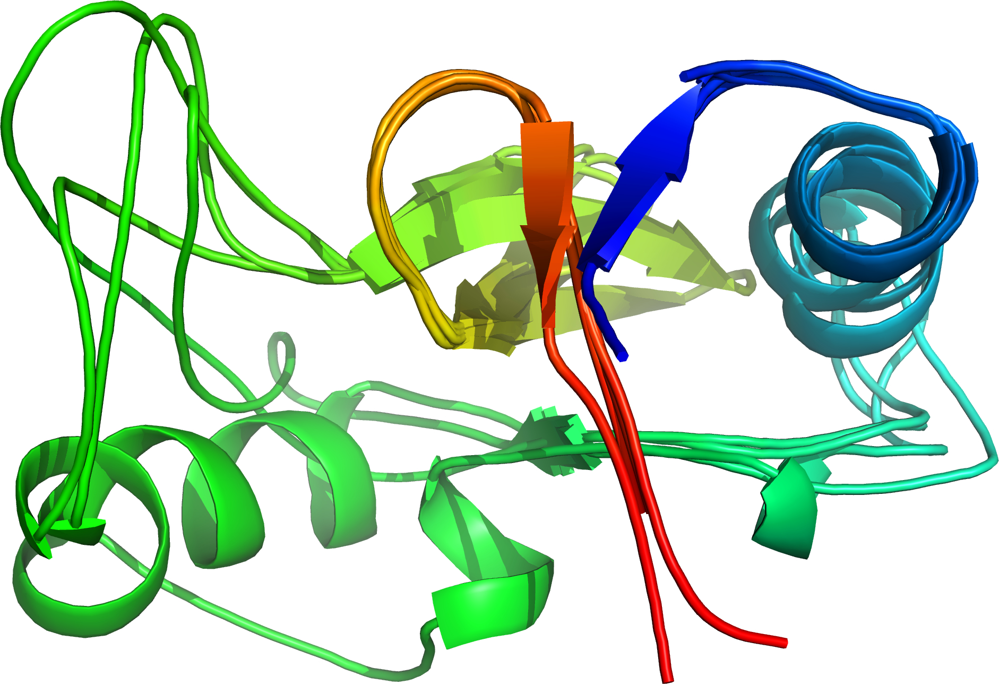

cath-superpose
==============

[**Downloads**](https://github.com/UCLOrengoGroup/cath-tools/releases/latest)

 
 
*__Left__: A standard superposition of [1fi2A00](http://www.cathdb.info/version/latest/domain/1fi2A00)/[1j58A01](http://www.cathdb.info/version/latest/domain/1j58A01) is disrupted by divergent regions; __Right__: `cath-superpose` does better by targeting the similar regions (but at the cost of increased RMSD). [rendered by PyMOL]*

-----

The cath-superpose tool makes superpositions that look better (even though they may have higher overall RMSDs).

It does this by focusing the superposition on those parts of the alignment that align well so that other aligned regions with greater variance don't disrupt the superposition. To use cath-superpose, you need to give it a way to align the structures, which can be any of:

 * a SSAP alignment (ie `.list` file) (see [`cath-ssap`](cath-ssap))
 * a FASTA alignment
 * a CORA alignment <!-- TODO: Add reference to CORA paper here -->
 * a file containing all the pairwise SSAP scores between a group of structures in a directory contains all the corresponding SSAP alignment files
 * the rule to just align residues by matching their names (number+insert) (useful for superposing models of the same protein)

**Example**: to generate a SSAP alignment and then pass it to cath-superpose, set up your environment for SSAP () and then  use commands like:

~~~~~no-highlight
./cath-ssap 1cukA 1bvsA
./cath-superpose --ssap-aln-infile 1cukA1bvsA.list --pdb-infile /global/data/directories/pdb/1cukA --pdb-infile /global/data/directories/pdb/1bvsA --sup-to-pymol
~~~~~

(This will attempt to fire up [PyMOL](https://www.pymol.org/) to view the superposition; see the usage for different options.)

Multiple Superpositions
-----------------------

 
*Four similar structures superposed by `cath-superpose` [rendered by PyMOL]*

`cath-superpose` can superpose more than two structures (see `--ssap-scores-infile`), but that currently requires you to prepare data for it and that can be a bit fiddly (eg running all-vs-all `cath-ssap`s). Until we make `cath-superpose` a bit friendlier on this front, we provide a simple Perl script `cath-superpose-multi-temp-script` to help you out. To get going: download it ([GitHub page](https://github.com/UCLOrengoGroup/cath-tools/blob/master/cath-superpose-multi-temp-script), [raw](https://raw.githubusercontent.com/UCLOrengoGroup/cath-tools/master/cath-superpose-multi-temp-script)), make it executable (eg `chmod +x cath-superpose-multi-temp-script`) and put it in one of your `PATH` directories or prepend it with `./` whenever executing it.

Also, ensure that `cath-ssap` is in one of your `PATH` directories and that you've set any environment variables to allow it to find the correct input files.

To prepare a new multiple superposition, create a temporary directory for your data and then run `cath-superpose-multi-temp-script` with that directory and a list of structures to superpose as arguments, eg:

~~~~~no-highlight
mkdir /tmp/my_dir
cath-superpose-multi-temp-script /tmp/my_dir 2vxnA00 2y7eB00 3b4uA00 1p1xB00
~~~~~

This performs the necessary `cath-ssap`s, writes out a file containing the pairwise scores and then prints out two commands: a `cath-superpose` command to use this data to superpose the structures and write out a [PyMOL](https://www.pymol.org/) script file, and a [PyMOL](https://www.pymol.org/) command to view it. Eg:

~~~~~no-highlight
cath-superpose --ssap-scores-infile /tmp/my_dir/ssap_scores.a861b298bf224759c5a6279581157f88 --pdb-infile $PDBDIR/1p1xB00 --pdb-infile $PDBDIR/2vxnA00 --pdb-infile $PDBDIR/2y7eB00 --pdb-infile $PDBDIR/3b4uA00 --sup-to-pymol-file a861b298bf224759c5a6279581157f88.pml
pymol a861b298bf224759c5a6279581157f88.pml
~~~~~

Now, you can customise the `cath-superpose` command to suit your needs.

You can also specify corresponding pairs of structures and the regions of the structures that you want to align and superpose:

~~~~~no-highlight
mkdir /tmp/my_dir
cath-superpose-multi-temp-script /tmp/my_dir 2vxn 'D[2vxnA00]2-250:A' 2y7e 'D[2y7eB00]-2-275:B' 3b4u 'D[3b4uA00]4-290:A' 1p1x 'D[1p1xB00]1000-1250:B'
~~~~~

The format is like: `D[5inwB02]251-348:B,408-416A:B`. Put <regions> in quotes to prevent the square brackets confusing your shell ("No match").

Usage
-----

The current usage information is:

~~~~~no-highlight
Usage: cath-superpose alignment_source pdb_file_source [superposition_outputs]

Superpose protein structures using an existing alignment

Please specify:
 * one alignment
 * one method of reading PDB files (number to match the alignment)

Miscellaneous:
  -h [ --help ]                   Output help message
  -v [ --version ]                Output version information

Alignment source:
  --res-name-align                Align residues by simply matching their names (numbers+insert)
                                  (for multiple models of the same structure)
  --fasta-aln-infile <file>       Read FASTA alignment from file <file>
  --ssap-aln-infile <file>        Read SSAP alignment from file <file>
  --cora-aln-infile <file>        Read CORA alignment from file <file>
  --ssap-scores-infile <file>     Read SSAP scores from file <file>
                                  Assumes all .list alignment files in same directory

ID options:
  --id arg                        Structure ids

PDB files source:
  --pdb-infile <pdbfile>          Read PDB from file <pdbfile> (may be specified multiple times)
  --pdbs-from-stdin               Read PDBs from stdin (separated by line: "END   ")

Alignment output:
  --aln-to-cath-aln-file arg      [EXPERIMENTAL] Write the alignment to a CATH alignment file
  --aln-to-cath-aln-stdout        [EXPERIMENTAL] Print the alignment to stdout in CATH alignment format
  --aln-to-fasta-file arg         Write the alignment to a FASTA file
  --aln-to-fasta-stdout           Print the alignment to stdout in FASTA format
  --aln-to-ssap-file arg          Write the alignment to a SSAP file
  --aln-to-ssap-stdout            Print the alignment to stdout as SSAP
  --aln-to-html-file arg          Write the alignment to a HTML file
  --aln-to-html-stdout            Print the alignment to stdout as HTML

Superposition output:
  --sup-to-pdb-file arg           Write the superposed structures to a single PDB file arg, separated using faked chain codes
  --sup-to-pdb-files-dir arg      Write the superposed structures to separate PDB files in directory arg
  --sup-to-stdout                 Print the superposed structures to stdout, separated using faked chain codes
  --sup-to-pymol                  Start up PyMOL for viewing the superposition
  --pymol-program arg (="pymol")  Use arg as the PyMOL executable for viewing; may optionally include the full path
  --sup-to-pymol-file arg         Write the superposition to a PyMOL script arg
                                  (Recommended filename extension: .pml)
  --sup-to-json-file arg          Write the superposition to JSON superposition file
                                  (Recommended filename extension: .sup_json)

Viewer (eg PyMOL, Jmol etc) options:
  --viewer-colours <colrs>        Use <colrs> to colour successive entries in the viewer
                                  (format: colon-separated list of comma-separated triples of RGB values between 0 and 1)
                                  (will wrap-around when it runs out of colours)
  --gradient-colour-alignment     Colour the length of the alignment with a rainbow gradient (blue -> red)
  --show-scores-if-present        Show the alignment scores
                                  (use with gradient-colour-alignment)
  --scores-to-equivs              Show the alignment scores to equivalent positions, which increases relative scores where few entries are aligned
                                  (use with --gradient-colour-alignment and --show-scores-if-present)
  --normalise-scores              When showing scores, normalise them to the highest score in the alignment
                                  (use with --gradient-colour-alignment and --show-scores-if-present)

Usage examples:
 * cath-superpose --ssap-aln-infile 1cukA1bvsA.list --pdb-infile $PDBDIR/1cukA --pdb-infile $PDBDIR/1bvsA --sup-to-pymol
     (Superpose 1cukA and 1bvsA (in directory $PDBDIR) based on SSAP alignment file 1cukA1bvsA.list and then display in PyMOL)
 * cat pdb1 end_file pdb2 end_file pdb3 | cath-superpose --pdbs-from-stdin --sup-to-stdout --res-name-align
     (Superpose the structures from stdin based on matching residue names and then write them to stdout [common Genome3D use case])

Please tell us your cath-tools bugs/suggestions : https://github.com/UCLOrengoGroup/cath-tools/issues/new
~~~~~

Feedback
--------

Please tell us about your cath-tools bugs/suggestions [here](https://github.com/UCLOrengoGroup/cath-tools/issues/new).
